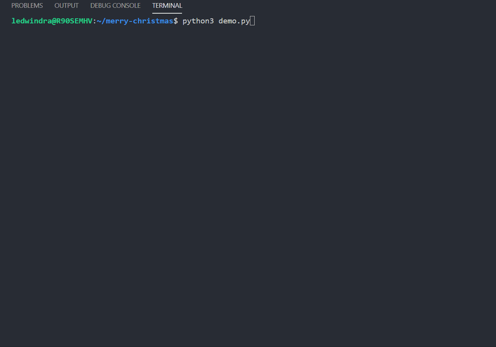

# About

Ho ho ho :santa:! Welcome to my repository! Here, we will create a simple program that produces a Christmas wish :christmas_tree:. I hope you enjoy this. :smile:

# Clone

If you want to do this on your machine, run the following command on your terminal:

```
cd ~
git clone https://github.com/ledwindra/merry-christmas.git
cd ./merry-christmas
```

Simple, right? Ho ho ho :santa:!

# Run

Then, you (perhaps with your :family:) can run the :snake: script on your :computer::

```
python3 src/merry_christmas.py [TRIANGLE_HEIGHT] [END_WISH] [YOUR_NAME]
```

Explanation: 

* `TRIANGLE_HEIGHT` :small_red_triangle: is needed to produce the Christmas tree. It will produce a list of odd numbers up until your imputed number. For example, if you type 18, it will produce `1, 3, 5, ..., 17`.

* `END_WISH` :pray: will produce the closure of the text. For example `Enjoy`, or `Sincerely`. Note if you want to add more than one word and it has whitespace between the words, then you'll need `\` before the space, for example `Yours\n truly`.

* `YOUR_NAME` :raising_hand: will produce a text that represents a name that you want to input. For example, `Santa`, or `Santa\n the\n Coder`

# Demo



Thank you for reading. Ho ho ho :santa::christmas_tree:!
